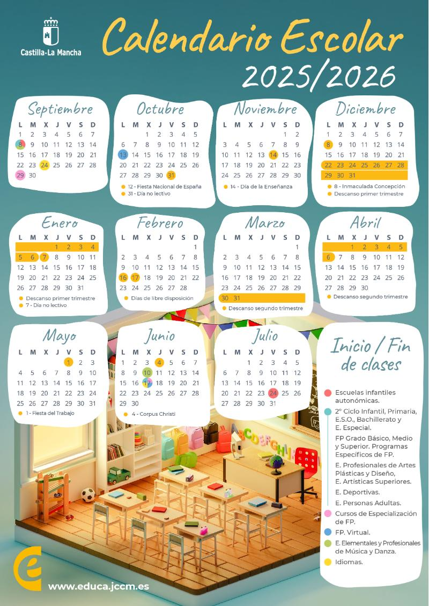

# Proyectos
## Desarrollo de Aplicaciones Multiplataforma
### IES Alonso de Ercilla

---

#### Proyectos desarrollados
**Proyectos en C# y XAML (Avalonia)**
1. [Gestión de bolígrafos](https://github.com/profe-dam2/ProyectoEspecialMartes)
2. Almacen de lo que sea

[//]: # ()
